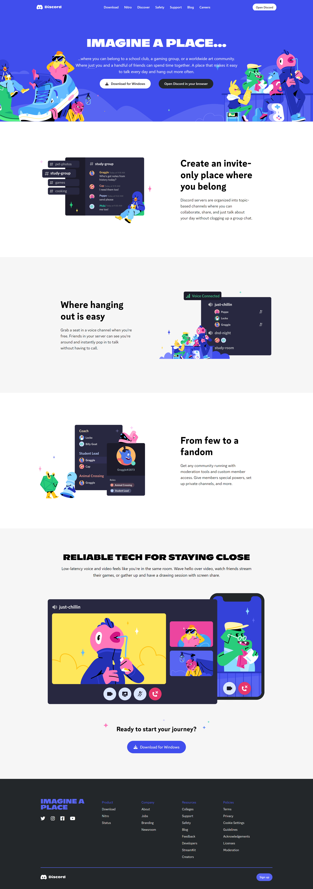

# Rode Landing Page clone 

## features

- This is Discord Homepage clone made using html5 and tailwind css.

- It is responsive in design and available in desktop, tablet and mobile screen.

## Preview of different screen sizes

1. Desktop size
   

2. tablet size
   

3. mobile size
   

## Author

- [Rakshit Koyani](https://www.github.com/rakshitkoyani)

  
  
  

## Live link of the project

https://discordhomeclone.netlify.app/
